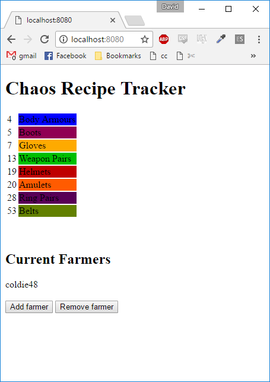

# chaos-recipe-tracker

A small web app meant for the game Path of Exile, that can track how many of each component of the chaos recipe you have. Supports multiple farmers who can then pool their items.

To use, modify `chaos-config.toml` as you see fit, launch the app, and navigate to `http://localhost:8080`. Make sure your stash tabs are public and named correctly. The colours are set to match `https://pastebin.com/cGM7CjSH` but feel free to change them.

